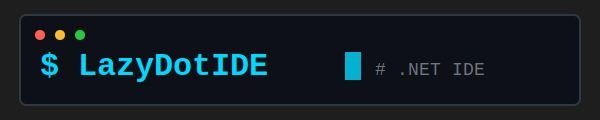

# LazyDotIDE

<div align="center">
  
</div>

<div align="center">

[](LICENSE)
[](https://www.nuget.org/packages/LazyDotIDE)
[](https://dotnet.microsoft.com/)
[]()

</div>

**A console-based .NET IDE built on [SharpConsoleUI](https://github.com/nickprotop/ConsoleEx).**

Browse, edit, build, test, and manage .NET projects without leaving the terminal. Full LSP IntelliSense, integrated git, multiple terminal modes, and a command palette — all in a TUI.

**Edit. Build. Ship.**


**[View more screenshots](docs/SCREENSHOTS.md)**

## Quick Start

```bash
dotnet tool install --global LazyDotIDE
lazydotide /path/to/your/project
```

Or from source:

```bash
git clone https://github.com/nickprotop/lazydotide.git
cd lazydotide
dotnet run -- /path/to/your/project
```

Run without arguments to open in the current directory.

## Features

### Editor
- Multi-tab editing with dirty tracking and unsaved-changes prompts
- Syntax highlighting for 12+ languages (C#, JSON, XML, YAML, Markdown, HTML, CSS, JavaScript/TypeScript, Razor, Dockerfile, Solution files, Diff)
- Manual syntax override via menu
- Find and replace (`Ctrl+F` / `Ctrl+H`)
- Word wrap modes (no wrap, word wrap, char wrap)
- Binary file detection (shown as non-editable)
- External file change detection with reload prompt

### IntelliSense / LSP
- Auto-completions triggered on `.`, `(`, `,`, and after typing (also `Ctrl+Space`)
- Go to definition (`F12`), go to implementation (`Ctrl+F12`), find all references (`Shift+F12`)
- Rename symbol across files (`Ctrl+F2`)
- Code actions (`Ctrl+.`)
- Format document (`Alt+Shift+F`)
- Hover / type info (`Ctrl+K`)
- Signature help (`F2`, auto-triggers on `(` and `,`)
- Real-time diagnostics (errors/warnings in status bar and problems panel)
- Document symbols in side panel (`Alt+O`)
- Navigation history with navigate back (`Alt+Left`)

### Git
- Stage, unstage, commit, push, pull, stash (with message), stash pop
- Branch listing, create branch, switch branch
- Diff (working directory, staged, full)
- Blame (per-line: SHA, author, date)
- Repository log and per-file log with commit detail view
- Gutter diff markers in editor (green/yellow/red for added/modified/deleted)
- Real-time status bar (branch, ahead/behind, M/A/D counts)
- Explorer badges per file (`M`, `A`, `D`, `U`, `R`, `!`, `I`)
- Gitignore support (add/remove paths, dimmed display in explorer)
- Discard changes
- Source control side panel with interactive staged/unstaged file list

### Build & Run
- Build (`F6`), test (`F7`), clean, run (`F5`) with colorized output
- Stop running process (`F4`)
- Problems panel with click-to-navigate on build errors/warnings
- Auto-detects `.csproj`, `.fsproj`, `.sln` build targets

### Terminal
- Bottom shell in output panel (`F8`)
- Editor tab shell (via menu)
- Side panel shell (`Shift+F8`)
- Full PTY support for interactive programs
- Multiple concurrent shell instances

### File Explorer
- Tree view with expand/collapse
- Git status badges and directory change indicators
- Gitignore dimming for ignored files
- Context menus (new file/folder, rename, delete, git operations)
- File watcher for automatic refresh on external changes

### NuGet
- [LazyNuGet](https://github.com/nickprotop/LazyNuGet) integration (`F9`) when installed
- Built-in add package dialog as fallback

### Workspace Persistence
Saved to `.lazydotide.workspace` in the project root on exit, restored on startup:
- Open files with cursor positions
- Panel visibility and column widths
- Split ratios and word wrap mode
- Explorer expanded nodes and selected path

### Custom Tools
Configure external tools in `config.json` — each tool appears in the Tools menu and command palette with options to open in a tab, bottom shell, or side panel.

### Command Palette
`Ctrl+P` opens a searchable palette of all commands, organized by category (File, Edit, Build, Run, View, Git, LSP, Terminal, NuGet, Tools, Help). Custom tools are included dynamically.

---

## Keyboard Shortcuts

### File

| Key | Action |
|-----|--------|
| `Ctrl+S` | Save current file |
| `Ctrl+W` | Close current tab |
| `Ctrl+N` | New file |
| `Ctrl+Shift+N` | New folder |
| `F2` | Rename (explorer focused) |
| `Delete` | Delete (explorer focused) |
| `Alt+Shift+R` | Reload file from disk |
| `Alt+F4` | Exit |

### Build & Run

| Key | Action |
|-----|--------|
| `F5` | Run project |
| `F6` | Build |
| `F7` | Run tests |
| `F4` | Stop |

### View

| Key | Action |
|-----|--------|
| `Ctrl+B` | Toggle file explorer |
| `Ctrl+J` | Toggle output panel |
| `Alt+;` | Toggle side panel |
| `Ctrl+P` | Command palette |

### Search

| Key | Action |
|-----|--------|
| `Ctrl+F` | Find / Replace |
| `Ctrl+H` | Find / Replace |

### LSP / IntelliSense

| Key | Action |
|-----|--------|
| `Ctrl+Space` | Show completions |
| `F12` | Go to definition |
| `Ctrl+F12` | Go to implementation |
| `Shift+F12` | Find all references |
| `Ctrl+F2` | Rename symbol |
| `Ctrl+.` | Code actions |
| `Ctrl+K` | Hover / type info |
| `F2` | Signature help |
| `Alt+Shift+F` | Format document |
| `Alt+O` | Document symbols |
| `Alt+Left` | Navigate back |

### Git

| Key | Action |
|-----|--------|
| `Alt+G` | Source control panel |
| `Ctrl+Enter` | Commit |

### Terminal

| Key | Action |
|-----|--------|
| `F8` | Shell in output panel |
| `Shift+F8` | Shell in side panel |
| `F9` | LazyNuGet (or NuGet dialog) |

---

## Syntax Highlighting

| Language | Extensions |
|----------|-----------|
| C# | `.cs` |
| JSON | `.json` |
| XML | `.xml`, `.csproj`, `.fsproj`, `.vbproj`, `.props`, `.targets` |
| YAML | `.yml`, `.yaml` |
| Markdown | `.md` |
| HTML | `.html`, `.htm` |
| CSS | `.css` |
| JavaScript / TypeScript | `.js`, `.jsx`, `.mjs`, `.cjs`, `.ts`, `.tsx`, `.mts`, `.cts` |
| Razor | `.razor`, `.cshtml` |
| Dockerfile | `Dockerfile`, `Dockerfile.*` |
| Solution | `.sln` |
| Diff | (used in git diff views) |

Syntax can be manually overridden via the Edit menu.

---

## Configuration

Config file location:
- **Linux/macOS**: `~/.config/lazydotide/config.json`
- **Windows**: `%APPDATA%\lazydotide\config.json`

A default config is created on first run. Edit it via **Tools > Edit Config** — changes reload automatically on save.

```json
{
  "lsp": null,
  "tools": [
    {
      "name": "htop",
      "command": "htop",
      "args": null,
      "workingDir": null
    },
    {
      "name": "Lazygit",
      "command": "lazygit",
      "args": null,
      "workingDir": null
    },
    {
      "name": "Git Log",
      "command": "bash",
      "args": ["-c", "git log --oneline --graph --all --color=always; exec bash"],
      "workingDir": null
    }
  ]
}
```

### Custom Tools

Each tool entry has:
- `name` — display name in menus and command palette
- `command` — executable to run
- `args` — optional argument array
- `workingDir` — optional working directory (null = project root)

### LSP Override

Set the `lsp` field to use a specific language server:

```json
{
  "lsp": {
    "command": "csharp-ls",
    "args": []
  }
}
```

---

## LSP Setup

LazyDotIDE auto-detects a C# language server in this order:

1. `lsp` field in `config.json`
2. `DOTNET_IDE_LSP` environment variable
3. `csharp-ls` in PATH
4. OmniSharp in known locations (`~/.omnisharp/`, `/opt/omnisharp/`)
5. `OmniSharp` in PATH

**Recommended**: install [csharp-ls](https://github.com/razzmatazz/csharp-language-server):

```bash
dotnet tool install --global csharp-ls
```

---

## Requirements

- .NET 10.0
- A terminal that supports ANSI escape codes
- Optional: `xclip`, `xsel`, or `wl-copy`/`wl-paste` for clipboard support on Linux

---

## Early Development

LazyDotIDE is in early development and not production-ready. Expect rough edges. It is a personal project — contributions and feedback are welcome, but set expectations accordingly.

---

## Built on

[**SharpConsoleUI**](https://github.com/nickprotop/ConsoleEx) — a console windowing and UI framework for .NET.
