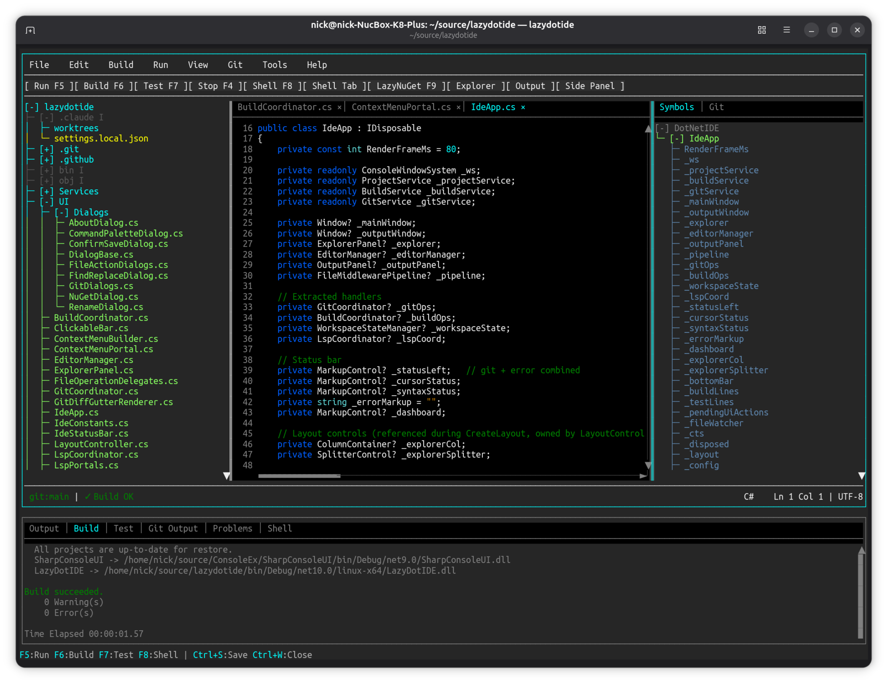
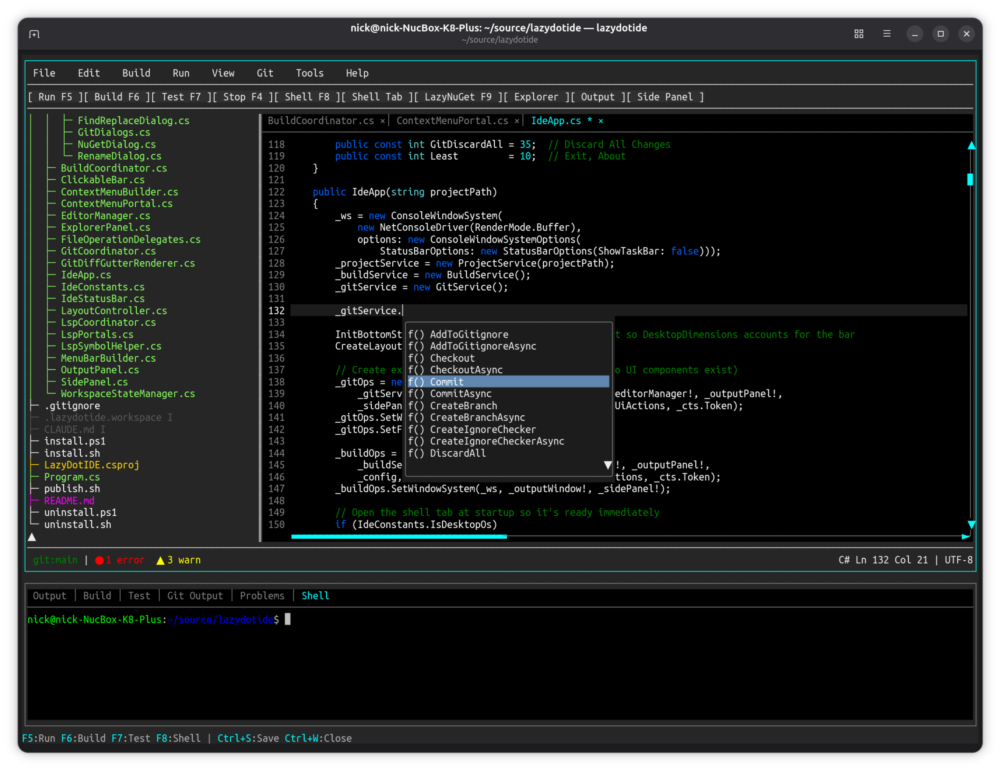
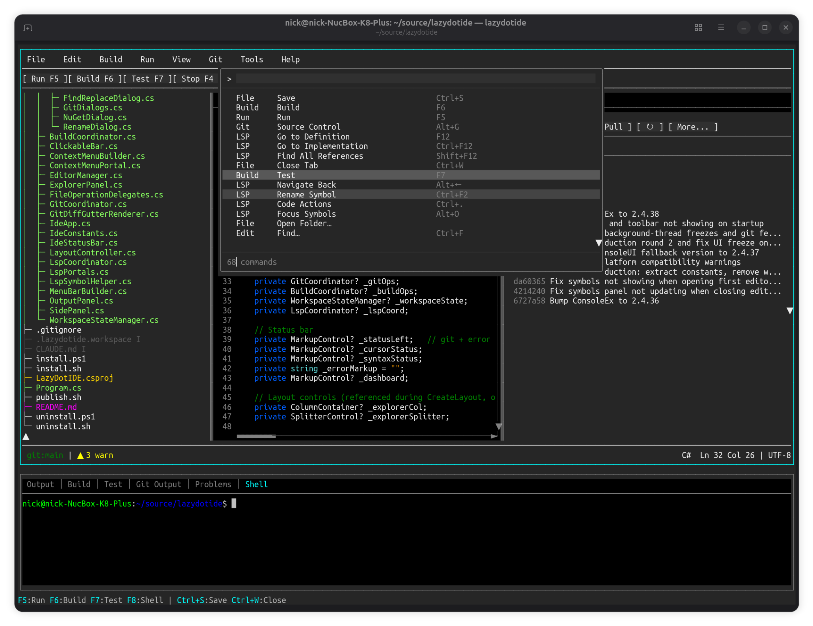
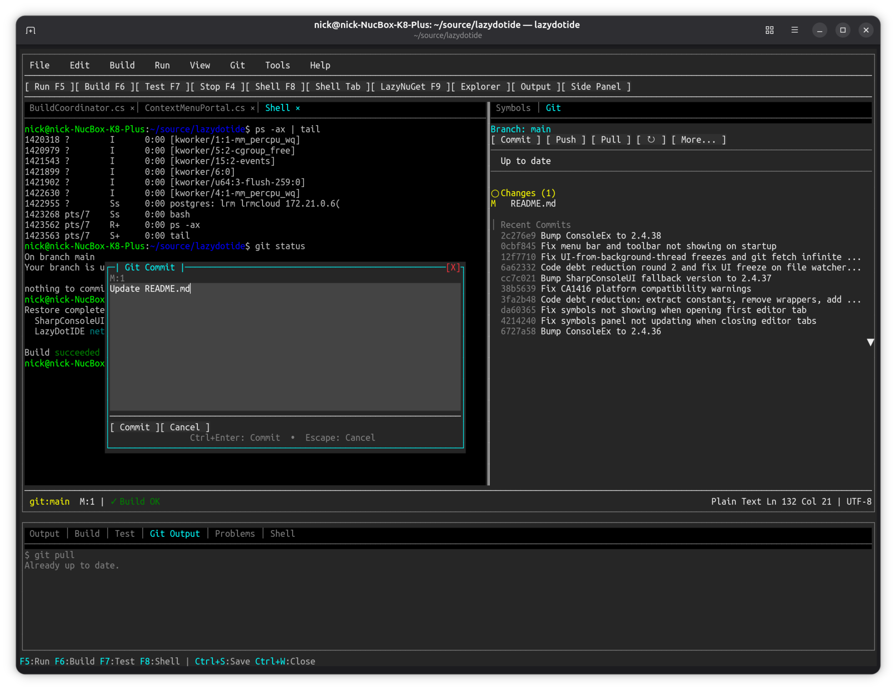
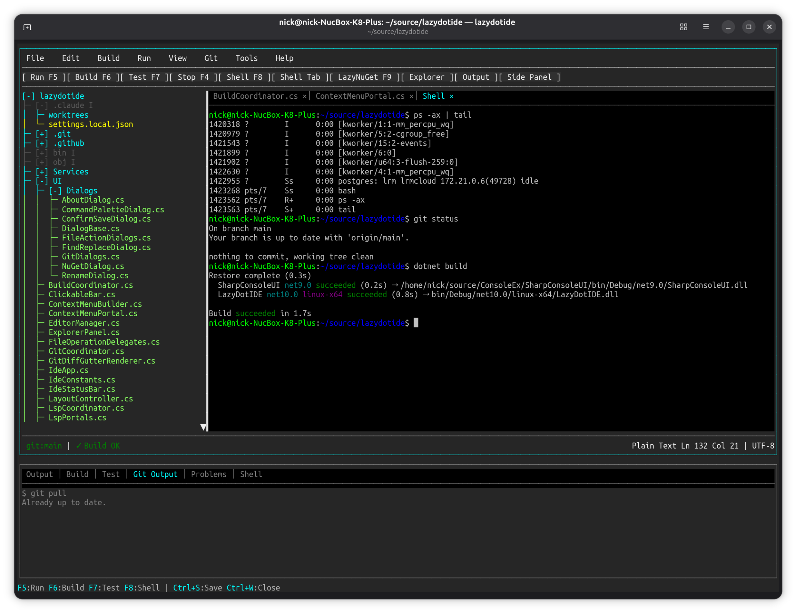
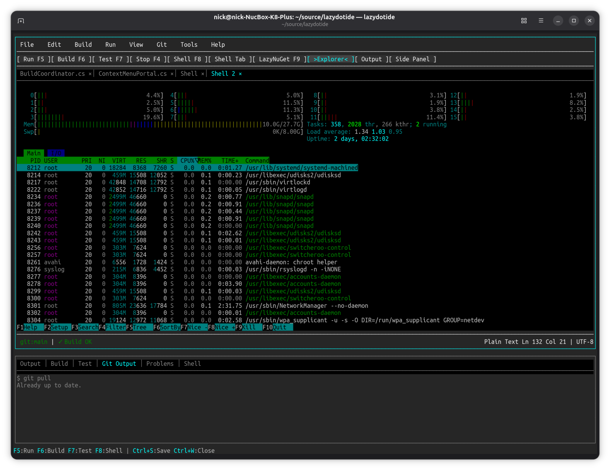
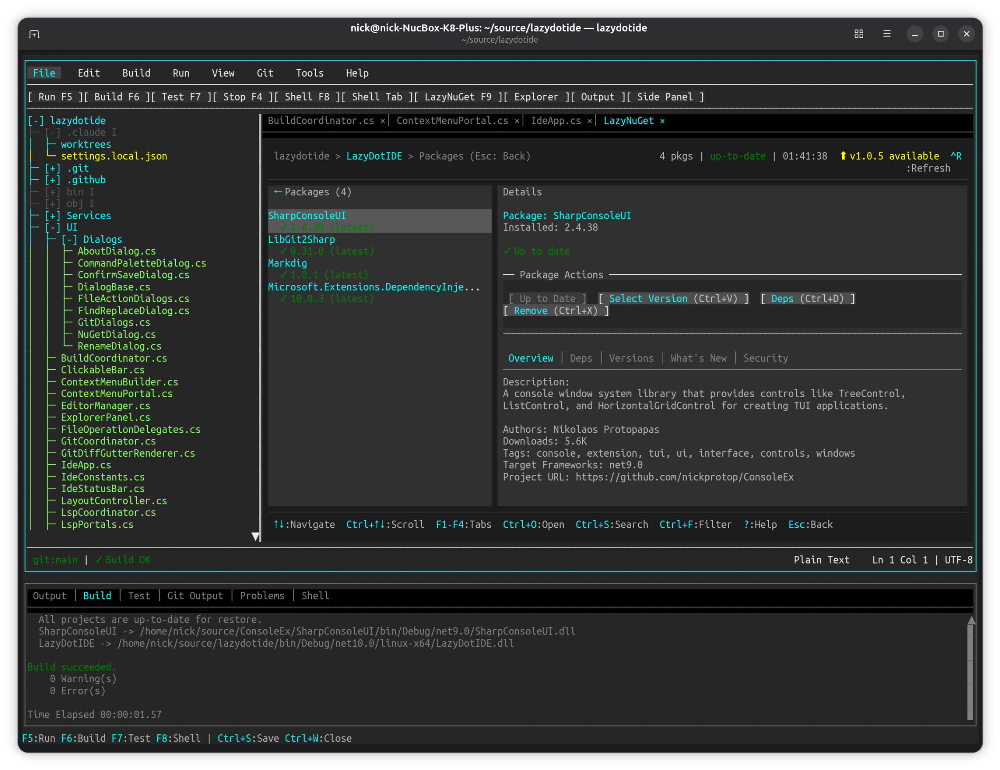

# LazyDotIDE Screenshots

## Main Editor

File explorer, multi-tab code editor with C# syntax highlighting, document symbols panel, and build output.

## Code Editing

Syntax-highlighted C# editing with the bottom shell terminal open.

## IntelliSense

LSP-powered autocomplete showing method and type completions inline.

## Command Palette

Searchable command palette (`Ctrl+P`) with commands organized by category, showing keybindings.

## Git Commit

Git commit dialog with source control side panel showing staged/unstaged changes, recent commits, and push/pull controls.

## Terminal Shell

Full PTY shell running in an editor tab — running commands like `ps`, `git status`, and `dotnet build`.

## Custom Tool — htop

htop running as a custom tool in an editor tab, demonstrating full interactive terminal support.

## NuGet Browser

LazyNuGet integration showing package search, details, and version management.

